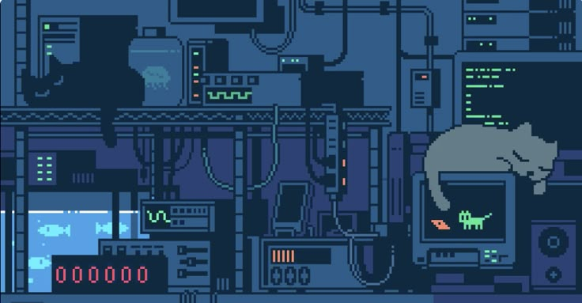
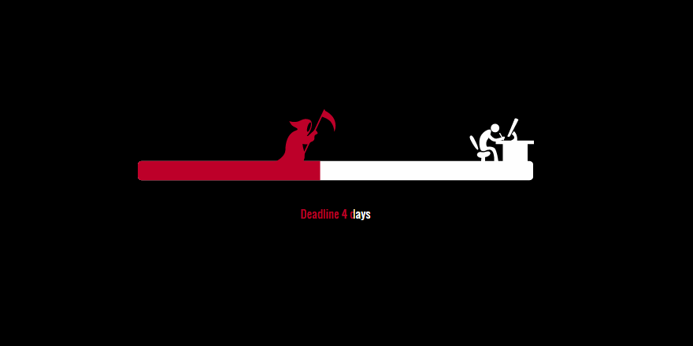

# Buenas, soy Mss Munroe :wave:

💻 Programadora y amante del café ☕ | Explorando mi código

## About me

- :student: Estudiante de Grado Superior DAM
- :pencil2: Aprendiendo idiomas y lenguajes de programación nuevos
- :top: **PEAK** en mi vida: dibujo + lectura
- :jack_o_lantern: Pensando en Halloween
- :joystick: Trabajando en 'Bosquea'

## Technologies

## :dizzy: Featured Project

-  :clapper: [Frame a Movie](https://github.com/MssMunroe/FrameAMovie): Web para descubrir películas y compartir opiniones en comunidad.

## :zap: Fun facts

- Me inspiro con bandas sonoras mientras programo
- Soy fan de las historias raras y los mundos cinematográficos  
- Obsesionada con Satoru

## :bulb: Mis estadísticas

